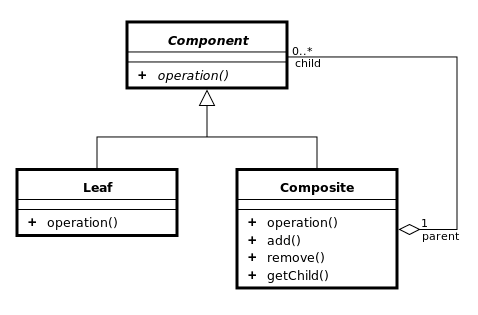

# 컴포지트  패턴

<b> 1. 키워드 </b>
 - 컨테이너와 내용물을 같게 다루기
 - 컨테이너 / 내용물 / 동일시

<b> 2. 정의  </b>
 - 객체들의 관계를 트리 구조로 구성하여 부분 - 전체 계층으로 표현하는 패턴 
 - 단일 객체(single instance)든 객체들의 집합(group of instance)이든 같은 방법으로 취급
 - 다시 말해 객체들과 객체들의 집합간의 처리 방법의 차이가 없을 경우 사용하면 된다.
 
 

