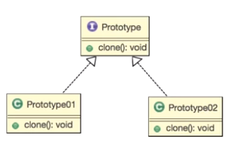

# 프로토 타입 패턴

 <b> 1. 정의 </b>
  - 사전적 의미: 원형, 본, 표준
  - 생산 비용이 높은 인스턴스를 복사 (clone()) 를 통해서 쉽게 생성 할 수 있도록 하는 패턴

  
 <b> 2. 인스턴스 생산 비용이 높은 경우 </b>
  - 종류가 너무 많아서 클래스로 정리되지 않는 경우
  - 클래스로부터 인스턴스 생성이 어려운 경우
   

# 문제

1. 일러스트레이터와 같은 그림 그리기 툴을 개발 중입니다.
 어떤 모양(shape)을 그릴 수 있도록 하고 복사 붙여넣기 기능을 구현해주세요.

2. 복사 후 붙여 넣기를 하면 두 도형이 겹치는데 안 겹치도록 살짝 옆으로 이동하게 해주세요.