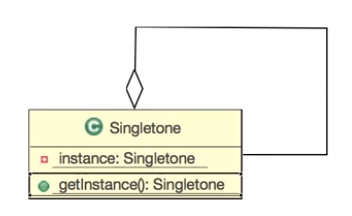

# 싱글톤 패턴

 <b> 1. 객체란? </b>
  - 객체: 속성과 기능을 갖춘 것
  - 클래스: 속성과 기능을 정의한 것
  - 인스턴스: 속성과 기능을 가진 것 중 실재 하는 것
  
 <b> 2. 정의 </b>
  - 싱글톤 패턴을 통해서 하나의 인스턴스만 생성하도록 구현할 수 있다.
  - 하나만 생성해야할 객체(인스턴스)를 위한 패턴
   

# 문제

1. 개발 중인 시스템에서 스피커에 접근할 수 있는 클래스를 만들어주세요.
2. 인스턴스를 호출할 때 로그를 찍어주는 소스를 추가
