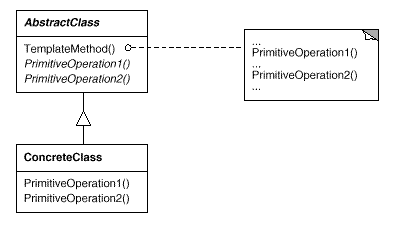

# 템플릿 메소드 패턴
 <b> 1. 정의</b>
  - 공통적인 프로세스를 묶어 주기
  - 알고리즘의 구조를 메소드에 정의하고, 하위 클래스에서 알고리즘 구조의  변경없이 알고리즘을 재정의 하는 패턴
 
 <b> 2. 언제 사용해야 할까</b>
  - 구현하려는 알고리즘이 일정한 프로세스가 있다. (여러 단계로 나눌 수 있다)
  - 구현하려는 알고리즘이 변경 가능성이 있다.
 
 <b> 2. 어떻게 사용해야 할까</b>
  - 알고리즘을 여러 단계로 나눈다
  - 나눠진 알고리즘 단계를 메소드로 선언한다
  - 알고리즘을 수행할 템플릿 메소드를 만든다
  - 하위 클래스에서 나눠진 메소드를 구현한다.
   

# 요구 사항
1. 신작 게임의 접속을 구현해주세요.
 - requestConnection(String str): String
2. 유저가 게임 접속 시 다음을 고려해야합니다.
 1) 보안 과정: 보안 관련 부분을 처리합니다
   - doSecurity(String string): String
 2) 인증 과정: user name과 password가 일치하는지 확인합니다.
   - authentication(String id, String password): boolean
 3) 권한 과정: 접속자가 유료 회원인지 무료 회원인지 게임 마스터인지 확인합니다.
   - authorizaion(String userName): int
 4) 접속 과정: 접속자에게 커넥션 정보를 넘겨줍니다
   - connection(String info): String
   
3. 추가 요구사항
 - 보안 부분이 정부 정책에 의해서 강화 되었습니다. 강화된 방식으로 코드를 변경해야 합니다.
 - 여가부에서 밤 10시 이후에 접속이 제한 되도록 요청이 들어왔습니다.